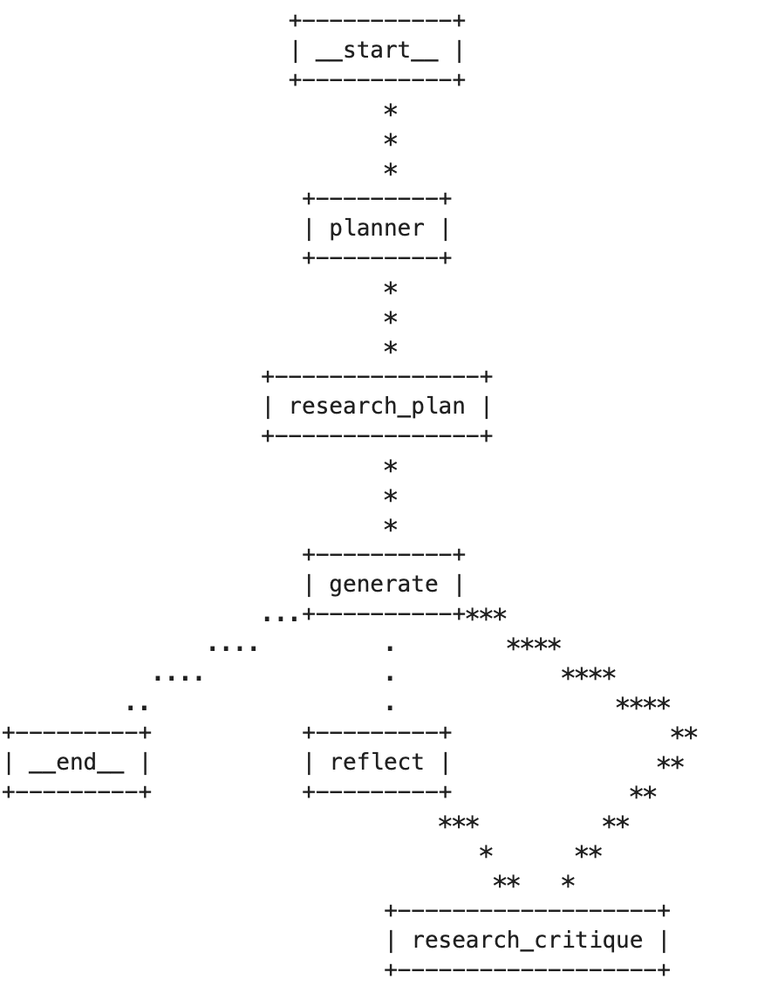

# cf Essay Writer Agent

This is an AI agent that can write essays for the topic provided. It uses a pre-trained language model to generate the essay based on the problem statement and the provided prompt template.  The agent uses plan, research, generate, reflect, research_critique nodes to implement the essay writing process.  The agent uses the following tools to build the agent: Langgraph, Tivily Search, Gradio, and Python.

## Usage

1. Clone the repository to your local machine.
<pre>
git clone https://github.com/kirtiapte/cf-essay-writer-agent.git
cd cf-essay-writer-agent
</pre>
2. Install the required dependencies 
<pre>
uv init
uv .venv
source venv/bin/activate
uv pip compile pyproject.toml > requirements.txt
pip install -r requirements.txt
</pre>
3. create and configure the .env file Create a .env file in the root directory and assign the necessary API keys:
<pre>
OPENAI_API_KEY = "your_openai_api_key"
OPENAI_API_MODEL = "your_openai_api_model"
TAVILY_API_KEY = "your_tavily_api_key"
</pre>
4. Run the agent by executing 
<pre>
uv run app.py
</pre>

## Deploy on Tanzu Platform for Cloudfoundry

1. Update manifest.yml file with the environment variables
<pre>
TAVILY_API_KEY: "your-api-key-here"
</pre>
2. Update manifest.yml file with the gen ai service binding
<pre>
services:
- "your-gen-ai-service-name"
</pre>
3. Deploy the application on Tanzu Platform for Cloudfoundry
<pre>
cf push -f manifest
</pre>

